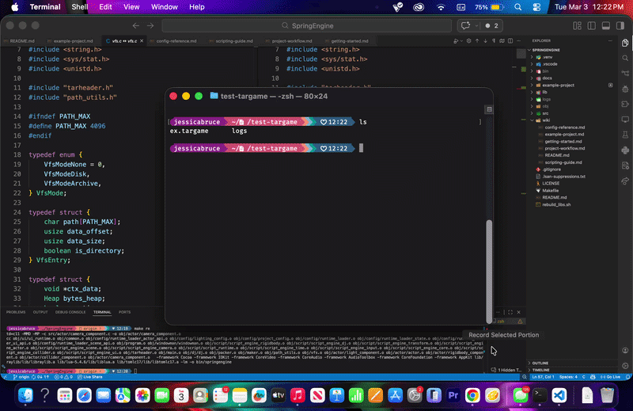

# SpringEngine

<table>
  <tr>
    <td valign="top" width="45%">
      
    </td>
    <td valign="top" style="font-size: 150%;">
      <p>SpringEngine is a runtime for games, not a single game executable.</p>
      <p>The goal is the same spirit as Java’s “write once, run anywhere” ideology:</p>
      <ul>
        <li>Game creators build against one stable runtime contract.</li>
        <li>Players install SpringEngine once.</li>
        <li>The same packaged game should run anywhere SpringEngine runs.</li>
      </ul>
    </td>
  </tr>
</table>

## Runtime 

- Runtime binary: `springengine`
- Game input: project folder or `.targame`
- Optional extension model: native module loading (platform dependent)

Execution flow:

1. Install SpringEngine.
2. Download a SpringEngine-compatible game package.
3. Run it with SpringEngine.

## Lua Scripting

SpringEngine follows a Unity-like composition approach with Lua as the default gameplay language.

- Scenes define entities/components.
- Scripts provide behavior hooks (`awake`, `start`, `update`, `on_destroy` style lifecycle).
- Prefabs enable reusable actor templates.
- Runtime systems (rendering, audio, input, physics-facing integration) remain native C.

Typical imports:

```lua
local Engine = require("Engine")
local Input = require("Engine.Input")
local Time = require("Engine.Time")
local Scene = require("Engine.Scene")
```

Current module surface includes:

- `Engine`
- `Engine.Input`
- `Engine.Time`
- `Engine.Transform`
- `Engine.Actor`
- `Engine.Camera`
- `Engine.Scene`
- `Engine.DJ`
- `Engine.UI`
- `Engine.Disk`

## Current Project Priorities

- Right now, this is just a proof of concept, there isn't really a 
  springengine project gui editor, so all your `.conf` files have to be edited
  manually :|. I've cobbled together a game this way in `example-project` if you 
  want to dig around to find out how the conf system works.
- Strengthen runtime/package compatibility boundaries.
- Keep engine/game deliverables cleanly separated.
- Expand Lua API while preserving stability.
- Improve package execution reliability for both folder and `.targame` flows.
- Continue config-first architecture work.

Related design docs:

- `docs/config-system-vision.md`
- `docs/ui-system-vision.md`
- `docs/lighting-system-vision.md`
- `docs/shader-system-roadmap.md`
- `docs/child-actor-system-vision.md`

## Wiki

Practical guides and references live in `wiki/`:

- `wiki/README.md`
- `wiki/getting-started.md`
- `wiki/project-workflow.md`
- `wiki/scripting-guide.md`
- `wiki/config-reference.md`
- `wiki/example-project.md`

## Build and Run

This projects uses the libraries in `/lib` which contains source code for all of the
libraries. You need to build those to static libraries first before building the 
springengine executable. There's a helper for this: `rebuild_libs.sh`

### Build Commands

- Build: `make`
- Debug build (ASan): `make debug`
- Release matrix (static): `make release` or `make release all`
- Tests: `make test`
- Clean objects: `make clean`
- Clean objects + binaries: `make fclean`

`make release` emits binaries under `bin/release/<target>/`:

- `bin/release/linux-x86_64/springengine-linux-64`
- `bin/release/linux-i686/springengine-linux-32`
- `bin/release/windows-x86_64/springengine-win-64.exe`
- `bin/release/windows-i686/springengine-win-32.exe`
- `bin/release/macos-x86_64/springengine-macos-64`
- `bin/release/macos-arm64/springengine-macos-arm64`

You can customize release-only compiler optimizations via `RELEASE_FLAGS`:

- Example: `make release-all RELEASE_FLAGS="-O2 -DNDEBUG -flto"`

`release-all` continues through every target and reports failures at the end (instead of stopping at the first failed target).

If Linux cross-builds fail on macOS with missing `X11/Xlib.h`, use raylib's SDL backend for Linux targets (requires Linux-target SDL2 headers/libs):

- `make release-all RAYLIB_PLATFORM=PLATFORM_DESKTOP_SDL RAYLIB_SDL_INCLUDE_PATH=/path/to/linux-sdl2/include RAYLIB_SDL_LIBRARIES="-L/path/to/linux-sdl2/lib -lSDL2"`

### Runtime Commands

- Version: `bin/springengine --version`
- Validate version requirement only: `bin/springengine --validate-ver <project_or_archive_path>`
- Validate project configs: `bin/springengine --validate-config <project_or_archive_path>`
- Run project folder/archive: `bin/springengine --run <project_or_archive_path>`
- Pack folder to archive: `bin/springengine --pack <source_directory> <archive.targame>`
- Unpack archive: `bin/springengine --unpack <archive.targame> <destination_directory>`

Scaffolding helpers:

- `--make-proj <path_to_put_it> <project_name>`
- `--make-script <project_root> <script_name>`
- `--make-scene <project_root> <scene_name>`
- `--make-ui-doc <project_root> <doc_name>`
- `--make-shader <project_root> <shader_name>` — creates `shaders/<name>.shader.conf`, `.vert.glsl`, `.frag.glsl`
- `--make-material <project_root> <material_name>` — creates `materials/<name>.mat.conf`
- `--make-prefab <project_root> <prefab_name>` — creates `prefabs/<name>.prefab.conf`

Thanks :)
